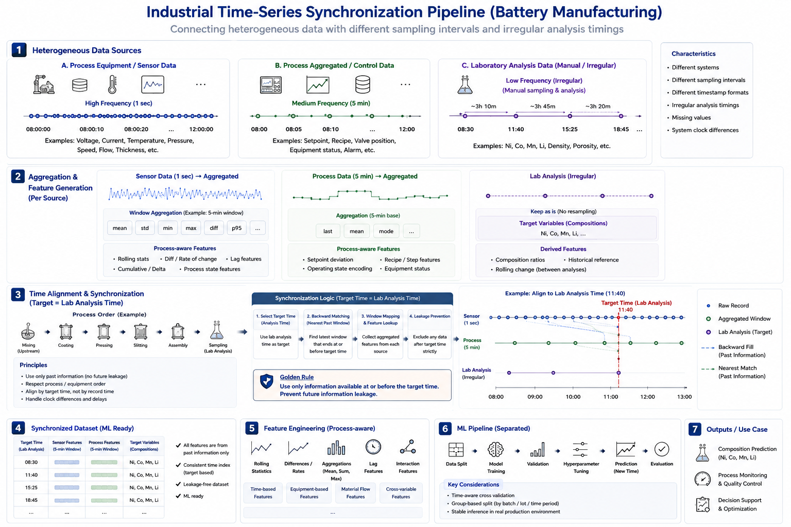
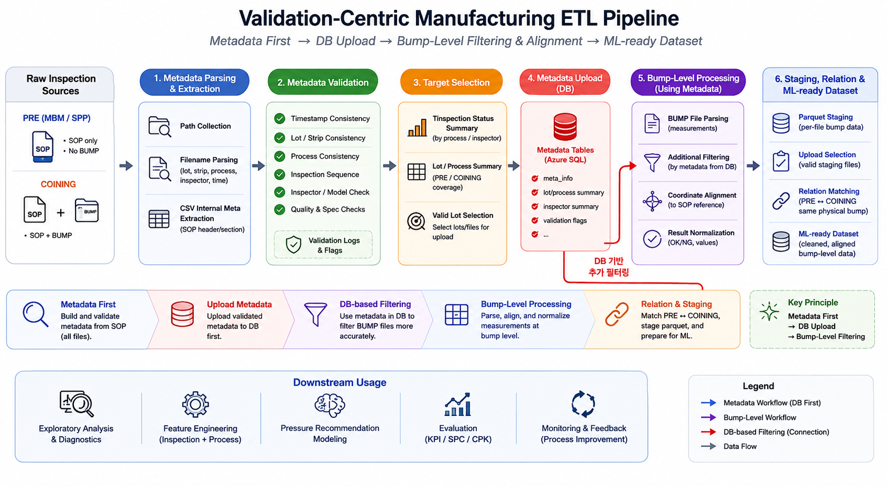

# Industrial ML System Design

## Overview

This repository summarizes practical experiences in industrial machine learning system design and large-scale manufacturing data processing.

Unlike benchmark datasets or competition environments,
real industrial datasets are generated continuously from multiple independent systems under operational constraints.

The projects described here focused not only on model performance,
but also on:

- data consistency
- time-series synchronization
- large-scale data processing
- feature engineering
- ETL pipeline design
- operational feasibility
- maintainable ML workflows

All descriptions are generalized and exclude confidential customer information or internal system details.

---

# Industrial AI Projects

# 1. Battery Manufacturing ML System

## Overview

This project focused on designing machine learning systems
for predicting material composition variables
such as Ni, Co, Mn, and Li
from battery manufacturing process data.

One of the major challenges was that
process sensor data and laboratory analysis data
were collected at different sampling intervals.

As a result,
time-series synchronization and process-aware feature engineering
became critical components of the system design.

---

## Industrial Time-Series Synchronization Pipeline

The pipeline aggregated historical process information
from heterogeneous manufacturing systems
and aligned them to irregular laboratory analysis timestamps
while preventing future information leakage.
## Why This Problem Was Challenging

In battery manufacturing environments,
process variables are often indirectly connected to final composition measurements.

Additionally:

- sensor data and laboratory data are generated independently
- timestamps are not perfectly synchronized
- process conditions evolve continuously
- distributions vary depending on operational states

Therefore,
the primary challenge was not only training predictive models,
but also constructing reliable learning datasets from heterogeneous manufacturing systems.

---

## Key Challenges

### Irregular Sampling Interval

Different sensors generated data at different frequencies.

Some process variables were recorded every few seconds,
while laboratory measurements were recorded every several minutes or hours.

This made direct comparison across variables difficult
without proper synchronization logic.

---

### Timestamp Mismatch

Timestamp mismatches existed between process systems and analysis systems.

In some cases,
the actual production timing and the recorded storage timing differed significantly.

This required careful preprocessing
to prevent target leakage during feature generation.

---

### Feature Consistency

Feature distributions changed depending on production conditions.

As a result,
process-aware feature engineering strategies were necessary.

Rolling statistics,
aggregation-based features,
and temporal change features
became important components of the pipeline.

---

## My Contributions

- Designed time-series synchronization logic
- Developed rolling / diff / aggregation-based feature engineering pipelines
- Built process-aware feature generation structures
- Processed multivariate manufacturing time-series data
- Designed target-specific ML pipelines for each composition variable
- Modularized training / validation / inference workflows
- Designed reproducible preprocessing structures
- Implemented data consistency validation logic

---

## Why Multivariate Prediction Was Important

The project focused on predicting multiple composition variables simultaneously
from manufacturing process data.

Because each target variable had different distributions,
sensitivities,
and process relationships,
individualized preprocessing and feature engineering strategies were required for each prediction target.

---

## System Design Considerations

The system was designed considering not only offline experimentation,
but also operational maintainability.

Key considerations included:

- reproducible preprocessing pipelines
- scalable feature generation structures
- maintainable ML workflows
- stable inference behavior
- validation-friendly preprocessing logic

Particular emphasis was placed on constructing pipelines
that could continuously validate incoming manufacturing data.

---

## Key Design Decisions

### Why Feature Engineering Was Prioritized

In industrial machine learning environments,
feature quality and data consistency often had greater impact
than increasing model complexity.

Therefore,
the project prioritized:

- process-aware feature generation
- time-series synchronization
- validation logic
- operational robustness
- maintainable preprocessing pipelines

rather than relying solely on highly complex modeling approaches.

---

## Key Learnings

- Data consistency can be more important than model complexity
- Feature engineering significantly impacts industrial ML performance
- Industrial datasets require system-level preprocessing strategies
- Operational feasibility must be considered early in ML system design
- Industrial ML problems are often system design problems rather than isolated modeling problems

---

# 2. Manufacturing Inspection AI System

# 2. Manufacturing Inspection AI System

## Overview

This project focused on designing
a manufacturing inspection AI system
and pressure recommendation pipeline
using inspection and production data.

The system aimed to improve process quality stability
through inspection-driven process pressure recommendations.

Major challenges included:

- multi-source inspection data integration
- large-scale bump-level data processing
- timestamp inconsistency
- process alignment across manufacturing stages
- operational constraints in production environments

---

## Validation-Centric Manufacturing ETL Pipeline

The pipeline validated inspection metadata first,
uploaded metadata tables to the database,
and then performed bump-level filtering,
alignment,
and relation matching using validated metadata.

This meta-first strategy improved consistency,
prevented invalid process pair construction,
and enabled reliable bump-level manufacturing analysis.

---

## Why This Problem Was Challenging

In manufacturing inspection environments,
quality measurements are often influenced
by multiple upstream process conditions simultaneously.

Additionally:

- production systems and inspection systems are physically separated
- inspection timing may occur much later than production timing
- identifiers may not perfectly align across systems
- operational constraints limit the use of highly complex models

As a result,
the project required both machine learning knowledge
and system-level data engineering considerations.

---

## Key Challenges

### Multi-source Inspection Data

Multiple inspection systems generated data
with different structures and identification schemes.

Differences included:

- file structures
- timestamp formats
- naming conventions
- identifier systems
- inspection granularity

Therefore,
cross-system consistency validation became a critical requirement.

---

### Large-scale Manufacturing Data

The project required processing large-scale manufacturing datasets,
including bump-level inspection data.

Efficient staging structures
and scalable data processing pipelines
became necessary for handling high-volume datasets.

Parquet-based staging structures were evaluated
to improve large-scale processing efficiency.

---

### Process Alignment

The project required aligning production units
across multiple manufacturing stages.

This included:

- strip-level alignment
- unit-level matching
- timestamp consistency validation
- production-inspection linkage validation

Reliable process alignment became essential
before constructing ML-ready datasets.

---

### Production Constraints

In real manufacturing environments,
model accuracy alone is insufficient.

Operational feasibility was equally important.

Key operational considerations included:

- inference stability
- explainability
- maintainability
- real-time operational constraints
- production workflow compatibility

---

## My Contributions

- Designed manufacturing inspection ETL structures
- Evaluated parquet-based staging pipelines
- Designed inspection timestamp validation logic
- Integrated multi-source manufacturing datasets
- Defined data quality validation strategies
- Implemented inspection consistency validation logic
- Designed data structures for pressure recommendation systems
- Discussed evaluation criteria and operational usage strategies
- Reviewed production-oriented ML pipeline structures

---

## Why Pressure Recommendation Was Important

The project aimed to improve manufacturing quality stability
by recommending process pressure conditions
based on inspection and production data.

However,
quality measurements were influenced not only by process pressure,
but also by:

- upstream process conditions
- inspection consistency
- operational variability
- manufacturing environment changes

Therefore,
reliable data validation and process alignment
became critical prerequisites before model training.

---

## System Design Considerations

The system was designed considering potential deployment environments
rather than only offline experimentation.

Key considerations included:

- scalable ETL structures
- validation-friendly preprocessing pipelines
- operationally maintainable workflows
- large-scale data handling
- stable production inference structures

Special attention was given to continuously validating
incoming inspection and production data.

---

## Key Design Decisions

### Why Validation Logic Was Critical

In manufacturing inspection environments,
incorrectly aligned data can easily produce misleading ML results.

Therefore,
the project emphasized:

- timestamp validation
- identifier normalization
- cross-system consistency checks
- abnormal data filtering
- process-aware validation logic

before focusing on model complexity.

---

## Key Learnings

- Industrial datasets rarely exist in ideal forms
- Data validation is critical in manufacturing ETL pipelines
- Production ML systems require operationally maintainable structures
- Reliable preprocessing pipelines are essential for industrial AI
- Industrial ML problems often require system-level thinking

---

# Why Industrial ML is Different

Unlike benchmark datasets,
industrial datasets are continuously generated
from multiple heterogeneous systems under operational constraints.

Common issues included:

- inconsistent timestamps
- missing inspection records
- identifier mismatches
- evolving production flows
- unstable data quality
- irregular sampling intervals

As a result,
successful industrial AI systems require much more than model accuracy.

They require:

- reliable data structures
- scalable preprocessing pipelines
- validation logic
- operational feasibility
- maintainable workflows

---

# Technical Keywords

- Manufacturing AI
- Industrial Machine Learning
- Time-Series Analysis
- Feature Engineering
- ETL Pipeline
- Data Consistency Validation
- Multi-source Data Integration
- Production ML System
- Large-scale Data Processing
- Manufacturing Inspection Data
- Pressure Recommendation System
- Battery Manufacturing AI
- Industrial Time-Series Processing
- Imbalanced Learning

---

# Disclaimer

This repository summarizes generalized industrial machine learning experiences
and system design considerations.

All customer-specific information,
internal system details,
production configurations,
and confidential operational information
have been excluded.
